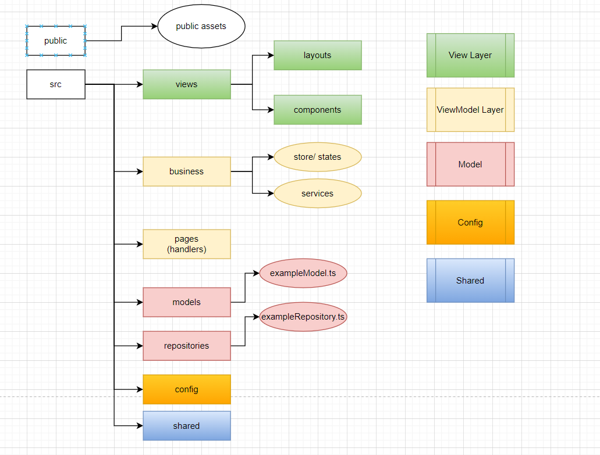

# NextJS Headfirst

Things you can learn in this solution

- [x] Setup, Debug
- [x] Styles & Assets (images, fonts, ...)
- [x] Main Concepts

## Setup & Debug & Tools

### Setup folder structure



MVVM:

- Model
- View
- ViewModel
  - Business
  - Controllers

```md
src -> entire source code
**[ViewModel]**

- pages -> controlers
- businesses -> state management, services

**[View]**

- views -> layouts, components, pages

**[Model]**

- models -> application's models
- repositories -> api calls

**[shared]**

- shared -> libraries, helpers

**[Others]**

- styles -> application's stylesheets
  - \_vars.scss -> theme's colors
  - \_mixins.scss -> shared mixins
  - global.scss -> global styles: font, spacing, blocks, forms
  - [pageName].scss -> custom styles for pages

public -> public assets
```

### Tools

- [VSCode React and Next.js Snippets](https://marketplace.visualstudio.com/items?itemName=AvneeshAgarwal.react-nextjs-snippets&ref=producthunt)

### Setup

```bash
npx create-next-app@latest --ts nextjsvietnam-app
```

### Debug

Create a file named .vscode/launch.json at the root of your project with the following content:

```json
{
  "version": "0.2.0",
  "configurations": [
    {
      "type": "node",
      "request": "attach",
      "name": "Next: Node",
      "skipFiles": ["<node_internals>/**"],
      "cwd": "${workspaceFolder}/nextjs-headfirst",
      "port": 9229
    },
    {
      "type": "chrome",
      "request": "launch",
      "name": "Next: Chrome",
      "url": "http://localhost:3000",
      "webRoot": "${workspaceFolder}/nextjs-headfirst",
      "sourceMaps": true,
      "sourceMapPathOverrides": {
        "webpack://_N_E/*": "${webRoot}/*"
      }
    }
  ]
}
```

Then start your app with this

```bash
npm run dev
```

In window you need this package "cross-env"

```json
  "scripts": {
    "dev": "NODE_OPTIONS='--inspect' next dev", // other os
    "dev:window": "cross-env NODE_OPTIONS='--inspect' next dev", // window os
    "build": "next build",
    "start": "next start",
    "lint": "next lint"
  },
```

## Styles and Assets

### 1. How to add sass support to NextJS Application?

```bash
npm i sass --save-dev
```

### 2. How to add tailwindcss to NextJS Application?

```bash
npm -D tailwindcss postcss autoprefixer
npx tailwindcss init
npm install -D @tailwindcss/forms
```

```js
// postcss.config.js
module.exports = {
  plugins: {
    tailwindcss: {},
    autoprefixer: {},
  },
};
```

[Tailwind Form](https://github.com/tailwindlabs/tailwindcss-forms)

### 3. Public assets

There are more than 2 ways to use image in nextjs

1. Use img tag and put the relative path

- Your image should be stored in **public** folder
- Use relative path
- Pros: easy and simple
- Cons: you have to optimized image by yourself. Eg: size, lazy load, adaptive images (different images on different device sizes)

2. Use Image component of next/image

- Source can be static or path string
- You can custom image loader
- You can custom image's properties: size, quality
- Support placeholder
- Config remote patterns to protect your application users from external images.
- [NextJS Image Component](https://nextjs.org/docs/api-reference/next/image)
- [NextJS Image Component Examples](https://github.com/vercel/next.js/tree/canary/examples/image-component)

```tsx
import type { NextPage } from "next";
import { useRouter } from "next/router";
import Image from "next/image";
import ImageNext from "next/future/image";
import HomeImage from "../public/assets/images/now-or-never.jpg";

const Home: NextPage = () => {
  const router = useRouter();
  return (
    <>
      <h1 className="heading">Example</h1>
      <p>BasePath: {router.basePath}</p>
      <ImageNext
        alt="Now or never"
        src={HomeImage}
        style={{
          maxWidth: "50%",
          height: "auto",
        }}
      />
      <Image
        alt="now or never"
        src={HomeImage}
        placeholder="blur"
        quality={100}
        style={{}}
      />
      
    </>
  );
};

export default Home;
```

3. Optimize Fonts

```tsx
// pages/_document.tsx
import { Html, Head, Main, NextScript } from "next/document";

export default function Document() {
  return (
    <Html>
      <Head>
        <link
          rel="stylesheet"
          href="https://fonts.googleapis.com/css2?family=Merriweather:wght@400;700&display=swap"
        />
        <link
          rel="stylesheet"
          href="https://fonts.googleapis.com/icon?family=Material+Icons"
        />
      </Head>
      <body>
        <Main />
        <NextScript />
      </body>
    </Html>
  );
}
```

4. Scripts

- Internal scripts
- External scripts

One of the most important things if time to interaction of user. It means user should be able to interact with your website ASAP.
Sometimes if your scripts are too large, this criteria will be increased.
So that NextJS provide us "Script" component which is optimized for loading script automatically.

```tsx
import { Html, Head, Main, NextScript } from "next/document";
import Script from "next/script";

export default function Document() {
  return (
    <Html>
      <Head>
        <link
          rel="stylesheet"
          href="https://fonts.googleapis.com/css2?family=Merriweather:wght@400;700&display=swap"
        />
        <link
          rel="stylesheet"
          href="https://fonts.googleapis.com/icon?family=Material+Icons"
        />
      </Head>
      <body>
        <Main />
        <NextScript />
        <Script
          async
          defer
          crossOrigin="anonymous"
          nonce="mFAfERTS"
          src="https://connect.facebook.net/vi_VN/sdk.js#xfbml=1&version=v15.0&appId=1778717048805106&autoLogAppEvents=1"
          strategy="lazyOnload"
        />
        <div id="fb-root"></div>
      </body>
    </Html>
  );
}
```

```tsx
<Script id="website-is-ready" strategy="lazyOnload">
  {`console.log('website is ready!')`}
</Script>
```

### Custom Head

```tsx
import Head from "next/head";
<Head>
  <title>Home Page</title>
  <meta charSet="utf-8" />
  <meta name="viewport" content="initial-scale=1.0, width=device-width" />
</Head>;
```

## Main concepts

### 1. Server Side Render

- The entire website will be rendered on server for every request. Includes: html pages, JSON Data and JS instructions to make component interact

**Flow**

- [MIDDLEWARE] http://localhost:3000/
- [Server Side Props]
- [APP] { title: 'Home page', description: 'NestJS Headfirst' }
- [COMPONENT RENDER] { title: 'Home page', description: 'NestJS Headfirst' }
- [DOCUMENT]

```tsx
import type {
  GetServerSideProps,
  InferGetServerSidePropsType,
  NextPage,
} from "next";
import Head from "next/head";

interface HomePageProps {
  title: string;
  description: string;
}

const Home: NextPage<InferGetServerSidePropsType<typeof getServerSideProps>> = (
  props: InferGetServerSidePropsType<typeof getServerSideProps>
) => {
  console.log("[COMPONENT RENDER]", props);
  return (
    <>
      <Head>
        <title>{props.title}</title>
        <meta name="description" content={props.description} />
        <meta charSet="utf-8" />
        <meta name="viewport" content="initial-scale=1.0, width=device-width" />
      </Head>
      <h1 className="heading">Example {props.title}</h1>
      <p>{props.description}</p>
    </>
  );
};

export const getServerSideProps: GetServerSideProps<HomePageProps> = async (
  context
) => {
  console.log("[Server Side Props]");
  return {
    props: {
      title: "Home page",
      description: "NestJS Headfirst",
    },
  };
};

export default Home;
```

### 2. Routes

All pages must be placed inside pages folder, their names will be used for manipulating the route handler.

```json
// index route
pages/index.tsx → /
pages/page-a/index.tsx → /page-a
// nested route
pages/page-a.tsx → /page-a
pages/dashboard/settings/username.js → /dashboard/settings/username
// dynamic route segments
pages/products/[pid].tsx → products/:productId
pages/products/[pid]/reviews.tsx → products/:productId/reviews
/pages/products/[...slug].tsx → /products/1/2 or /products/a/b => number of segments must be plural ( >= 2)
```

**next/router**

**next/link**

```ts
// pages/products/[categoryId]/index.tsx

import { GetServerSideProps, InferGetServerSidePropsType } from "next";

import type { NextPage } from "next";
import Link from "next/link";

interface productCategoryPageProps {
  category: {
    categorySlug: string;
    name: string;
  };
}

const productCategoryPage: NextPage<
  InferGetServerSidePropsType<typeof getServerSideProps>
> = (props: InferGetServerSidePropsType<typeof getServerSideProps>) => {
  const { category } = props;
  return (
    <>
      <h1>{category.name}</h1>
      <p>{category.categorySlug}</p>
      <ul>
        {Array.from(new Array(5)).map((_, index) => (
          <li key={index + 1}>
            <Link
              href={`/products/${category.categorySlug}/product-${index + 1}`}
            >{`Product ${index + 1}`}</Link>
          </li>
        ))}
      </ul>
    </>
  );
};

export default productCategoryPage;

export const getServerSideProps: GetServerSideProps<
  productCategoryPageProps
> = async (context) => {
  const categorySlug = context.query.categorySlug as string;
  const category = {
    categorySlug,
    name: `Category [${categorySlug}]`,
  };
  return {
    props: {
      category,
    },
  };
};

// pages/products/[productId]/index.tsx

import { GetServerSideProps, InferGetServerSidePropsType } from "next";

import type { NextPage } from "next";
import { useRouter } from "next/router";
import { useCallback } from "react";

interface productDetailPageProps {
  product: {
    productSlug: string;
    name: string;
  };
}

const productDetailPage: NextPage<
  InferGetServerSidePropsType<typeof getServerSideProps>
> = (props: InferGetServerSidePropsType<typeof getServerSideProps>) => {
  const { product } = props;
  const router = useRouter();
  const goback = useCallback(() => {
    router.push(`/products/${router.query["categorySlug"]}`);
  }, [product]);
  return (
    <>
      <h1>{product.name}</h1>
      <p>Category : {router.query["categorySlug"]}</p>
      <p>{product.productSlug}</p>
      <button
        className="bg-green-700 py-4 px-8 text-white"
        onClick={() => {
          goback();
        }}
      >
        Back
      </button>
    </>
  );
};

export default productDetailPage;

export const getServerSideProps: GetServerSideProps<
  productDetailPageProps
> = async (context) => {
  const productSlug = context.query.productSlug as string;
  const product = {
    productSlug,
    name: `product [${productSlug}]`,
  };
  return {
    props: {
      product,
    },
  };
};
```

### 3. Client Side

Same as normal web application, javascript will be used for rendering page after user's interaction.
In this case, nextjs client side works same as normal ReactJS Application.
Let's dive into todolist application

```ts
import type {
  GetServerSideProps,
  NextComponentType,
  NextPageContext,
} from "next";
import { useMemo, useState } from "react";

export enum TodoStatus {
  pending = "pending",
  inprogress = "inprogress",
  done = "done",
}
interface TodoModel {
  id: number;
  name: string;
  description?: string;
  status: TodoStatus;
}
interface TodosIndexProps {
  initialTodos: TodoModel[];
}

const TodosIndex: NextComponentType<NextPageContext, {}, TodosIndexProps> = (
  props: TodosIndexProps
) => {
  // component's properties
  const statusColors = {
    [TodoStatus.pending]: "bg-red-400",
    [TodoStatus.inprogress]: "bg-yellow-400",
    [TodoStatus.done]: "bg-green-400",
  };
  // application state
  const [todos, setTodos] = useState(props.initialTodos);
  const nextTodoId = useMemo(() => {
    return Math.max(...todos.map((todo) => todo.id)) + 1;
  }, [todos]);
  // handler events
  const onAddNewTask = () => {
    const newTask: TodoModel = {
      id: nextTodoId,
      name: `Task ${nextTodoId}`,
      description: "lorem",
      status: TodoStatus.pending,
    };
    setTodos([...todos, newTask]);
  };
  // should use views here
  return (
    <>
      <div className="max-h-screen min-h-screen">
        <div className="h-1/2">
          <button
            className="bg-blue-600"
            onClick={() => {
              onAddNewTask();
            }}
          >
            New task
          </button>
          {todos.map((todo) => (
            <div key={todo.id} className={`${statusColors[todo.status]} mb-2`}>
              <h3>{todo.name}</h3>
              <p>{todo.description}</p>
              <p>{todo.status}</p>
            </div>
          ))}
        </div>
      </div>
    </>
  );
};

export default TodosIndex;
export const getServerSideProps: GetServerSideProps<TodosIndexProps> = async (
  context
) => {
  const initialTodos: TodoModel[] = Array.from(new Array(5)).map((_, index) => {
    const statuses = [
      TodoStatus.pending,
      TodoStatus.inprogress,
      TodoStatus.done,
    ];
    return {
      id: index + 1,
      name: `Issue ${index + 1}`,
      description: `lorem ipsum blalasd aasd ${index + 1}`,
      status: statuses[Math.floor(Math.random() * 3)],
    };
  });
  return {
    props: {
      initialTodos,
    },
  };
};
```

### 4. Middleware

Middleware allows you to run code before a request is completed, then based on the incoming request, you can modify the response by rewriting, redirecting, adding headers, or setting cookies.

- [NextJS Middleware](https://nextjs.org/docs/advanced-features/middleware)

```ts
// middleware.ts
```

## References

- [NextJS Full Examples](https://github.com/vercel/next.js/tree/canary/examples)
